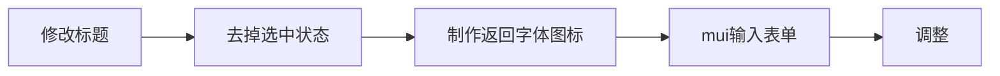
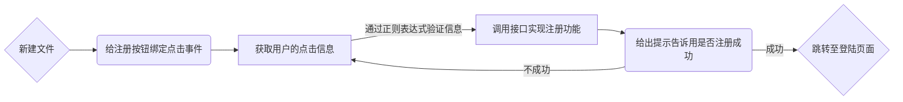

[TOC]

## img布局的基线问题

### 解决方法:

1. 图片设置 `float`
2. 图片设置 `display: block;`
3. 在图片的父级设置 `font-size: 0;`, 会导致在父对象中的文字都无法显示. 就算将文字用子对象包裹设置文字大小以显示, 但在CSS效验的时候会提示文字过小的错误. 
4. 设置图片的 `vertical-align` 属性为 `“top, text-top, bottom, text-bottom”` 也可以解决
5. 如果父对象的宽、高固定, 图片大小随父对象而定, 那么可以给父元素设置 `overflow:hidden;` 
6. 取消图片标签和其父对象的最後一个结束标签之间的空格. 但是会导致代码混乱,而且与IDE的设置相左. 仅作为bug原因的参考. 另: 在浏览器渲染中, 图片与图片之间默认换行的

### 问题成因解析

总的来说是由于img布局的默认基线对齐模式导致的, 图片的对齐模式与文本的默认行为类似, 下边缘是与基线对齐, 而不是紧贴容器下边缘. 

所以默认`vertical -align` 为 `baseline` 的图片会和父div之间存在空隙. 而基线 `baseline` 和 `bottom` 之间有一定的距离, 事实上 `inline` 的图片下面的空白就是这段距离产生的, 即使在没有文字的情况下, 只要代码中 `inline` 的图片后面有**空格或者换行符**都会默认使用基线对齐. 

在概念上 `top` 和 `bottom` 之间的距离即为 `line-height` , 所以把 `line-height` 设置的足够小 , 也可以解决该问题, 设置 `font-size: 0;` 也是同理, 因为在没有设置 `line-height` 的情况下,默认 `line-height` 值依不同渲染引擎会乘以一个系数(通常理解为1.2), 当然这样的后果就是图文混排出现问题. 

> 注意: 一个 `inline-block` 元素, 如果里面没有 `inline` 内联元素, 或者 `overflow` 不是 `visible` , 则该元素的基线就是其 `margin` 底边缘, 否则, 其基线就是元素里面最后一行内联元素的基线. 

> 所以在使用一些空元素进行占位的时候, 必须注意其基线可能与其中有内容的元素不一致,从而导致错位和缝隙的问题. 这种时候可以通过加入内联元素, 更改 `font-size: 0;` 或 `vertical-align: top/bottom/`

#### `vertical-align` 属性的应用

使图片基于中线对齐,就可以像文字一样通过行高来使其居中. 但是,字符的中线其实和父容器的真正绝对居中位置有一点区别, 而 `vertical-align: middle;` 属性为非继承特性属性, 所以需要用 `font-size: 0;` 修正. 当然使用一个空的行内样式设置 `vertical-align: middle;` 也是可行的, 该方法也可以运用于多行文本的居中显示. 

注意: 使用该方法时需要在图片标签结束处留下空格后者换行：

```css
div { line-height: 240px;font-size: 0;}
img { vertical-align: middle;}
```
`vertical-align: text-bottom/text-top` 可以使图片与文字的底线和顶线对齐,而避免其他行内元素的影响

## 使元素垂直居中方法扩展

1. 使用 `position:absolute`, 有固定宽度和高度的 `div`. 这个 `div` 被设置为 `top:0`;`bottom:0`;. 但是因为它有固定高度, 其实并不能和上下都间距为 0, 通常此时的定位会自动以 `left` 和 `top` 为准, 而使用 `margin:auto;` 可使它居中. 
```html
<div id="content"> Content here</div>  
```
```css
#content {
    position: absolute;
    top: 0;
    bottom: 0;
    left: 0;
    right: 0;
    margin: auto;
    height: 240px;
    width: 70%;
}
```
> 注意该方法IE8以下无效, 无足够空间时, content 会被截断, 但是不会有滚动条出现, 因为相当于定位出了窗口. 
2. `vertical-align: middle` 方法, 适用于行内块元素;
3. 绝对定位
```css
parentElement{
    position:relative;
}

childElement{
    position: absolute;
    top: 50%;
    transform: translateY(-50%);
}
```
4. 相对定位, 适用于子元素top默认为0的情况下使用
```css
parentElement{
    height:xxx;
}

.childElement {
    position: relative;
    top: 50%;
    transform: translateY(-50%);
}
```
5. Flex 布局：需要注意兼容问题
```css
parentElement{
    display:flex;/*Flex布局*/
    display: -webkit-flex; /* Safari */
    align-items:center;/*指定垂直居中*/
}
```
6. 利用 `table` 标签            
- 插入完整的 `table` , 包括 `table\tbody\tr\td`, 该元素写在 `td` 内, 子元素设置 `vertical-align:middle`
- 父元素设置 `display: table-cell;` 
```html
<div class="foo"></div>
```
```css
.foo {
    display: table-cell;
    vertical-align: middle;
}
.foo img {
    vertical-align: middle;
}       
```

## 使元素水平居中方法扩展

1. 在元素外加入 `table` 标签, 包括 `table\tbody\tr\td`, 该元素写在 `td` 内, 设置 `margin: auto`.             
2. 设置 `display: inline`, 通过 `text-align: center`
3. 定位
4. `margin: 0 auto;`


### 标签包裹的规则
<!-- TODO -->
- 基本规则, inline 元素不能包裹 block 元素和 inline-block

a标签包裹img时的一些问题

 float 会使a标签具有行内快的性质,所以此处不用给a标签转为block元素来包裹图片,相对的如果float加在a标签的父元素上时就需要转化a标签了

W3C 标准里面有提到 a 不能包裹 button 或者 a 这些 interactive content 元素,  

直接在查看器编辑代码`<a><a>xx</a></a>`浏览器会自动修正为`<a></a><a>xx</a>`,  

如果是通过 JS 来操作 DOM 就可以达到这个效果. 可以通过 appendChild之类的来实现.  

HTML 4 的 DTD 明确规定块级元素 p不能包裹其他块级元素,  

所以 `<p><div></div></p>` 是不行的. 


## 零散获取
<!-- TODO -->
### 有关移动端左右布局一二级分类标签样式
事实上在局部滚动中也可以给内容元素加上上下边距样式, 以此优化第一排显示样式, 通常会加载二级分类标签上, 但需要注意的是样式需要加在内部的内容盒子上, 外层的局部滚动标签不能调整;

### `text-decoration`
text-decoration 属性规定添加到文本的修饰. 
值 | 描述
-|-
none | 默认. 定义标准的文本. 
underline | 定义文本下的一条线. 
overline | 定义文本上的一条线. 
line-through | 定义穿过文本下的一条线. 
blink | 定义闪烁的文本. 
inherit | 规定应该从父元素继承 text-decoration 属性的值. 

> 注意: 在该属性中连写**颜色值**可以设置划线的颜色, 但并不清楚兼容性如何

> 同时与该属性相关的几个CSS属性主流浏览器几乎都不大支持需要注意

### CSS `inherit` 关键字 
`inherit` 关键字指定一个属性应从父元素继承它的值. 
`inherit` 关键字可用于任何 HTML 元素上的任何 CSS 属性. 
```css
property: inherit;
```

### `input` 标签

- `input` 标签在不同的浏览器中所默认的标签属性不一样,chrome中默认为 `inline-block` , 但是ie等会默认为 `inline` , 依照兼容性考虑最好明确设置为 `display: block/inline-block;` . 
- `input` 中的 `placeholder` 属性默认对齐定线, 会出现与输入文字错位的情况, 可以通过设置 `vertical-align` 解决, 或者单纯使用 `font-size` 撑开盒子,再使用padding撑开, 由于 `padding` 会导致元素延长, 可通过 `box-sizeing: border-box;` 解决. 
- 依不同的浏览器 `input` 标签会有默认的宽度和 `padding`, `border` , `outline` 等属性,在清除默认样式的基础上, 使用`box-sizing: border-box;` 进行设置可以回避大部分问题.
- `input` 标签的 `disabled` 属性用于禁止 `input` 标签的功能, 被禁用的输入字段是无法使用和无法点击的, 可通过js使用户在满足某些条件时(比如选中复选框, 等等)才能使用输入字段. 然后, 可使用 JavaScript 来删除 disabled 属性, 使该输入字段变为可用的状态. 

disabled 属性是一个布尔属性。

disabled 属性规定应该禁用的 <input> 元素。

被禁用的 input 元素是无法使用和无法点击的。

disabled 属性进行设置，使用户在满足某些条件时（比如选中复选框，等等）才能使用 <input> 元素。然后，可使用 JavaScript 来删除 disabled 值，使该<input> 元素变为可用的状态。

提示：表单中被禁用的 <input> 元素不会被提交。

注意：disabled 属性不适用于 <input type="hidden">。

> 注：disabled 属性不适用于 <input type="hidden">. 

> 提示：被禁用的表单元素不会被提交. 


css

### 2.偏移属性offset

top、right、bottom、left应用于定位元素。
**偏移属性定义了距离包含块相应边的偏移，而不是距离包含块左上角的偏移.**

3.width height属性

元素有外边距、边框、内边距时，设置了top、right、bottom、left之后，height和width设置为多大都不起作用。而无的话，则起作用。

top、right、bottom、left的值设置为正值时，元素向内收缩，设置为负值时，向外扩张。

4.限制高度和宽度min-width、min-height、max-width、max-height

用于非替换行内元素和表元素以外的所有元素。

windows平台的IE7之前都不支持这些属性。

5.clip:rect(top,right,bottom,left);

应用于绝对定位元素。

6.元素绝对定位时，如果除bottom外某个任意偏移属性设置为auto时，会有一种特殊的行为。


<!-- TODO -->
## 腾讯模板引擎 art-template


## 前端信息

## 课堂笔记
注册页面的页面结构

业务逻辑


<!-- TODO -->
js中的匿名类
`{key:value}`
`key` 可以在 `window` 中直接调用吗
以上写法是否等价于 `var key = value`

### artTemplate使用
artTemplate是一个先进的前端字符串模板引擎, 区别于VUE为代表的 `DOM` 模板引擎
artTemplate模板引擎是用于拼接html和后台数据,并返回将拼接好的数据
1. 依照所选用的语法格式,引入文件
2. 模板引擎相关代码现在通常会用 `script` 标签包裹, 
