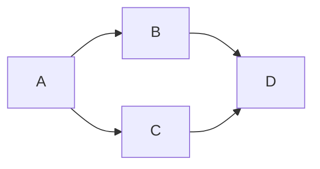

# H5C3

## 移动端

- 移动端布局 3天
- 响应式:全平台显示,内容不同
    - bootstap

### 对象

- 三要素: 属性+方法+回调函数

- 插件使用流程:

    ```flow
    st=>start: 引入
    e=>end: 初始化代码
    op=>operation: 写入结构
    st(right)->op(right)->e
    ```

### background:
- 注意 `background-size`必须写在方位后面,用`/`隔开
```css
background: pink url() no_repeat 100% 80% / 50px 70px;
                                        /*background-size*/
/*渐变所生成的是图像*/
/*线性渐变*/
/* background: linear-gradient(方向, 开始颜色 位置, 颜色2 位置, 颜色3 位置...); */
/**/
background: linear-gradient(to bottom, red 0%, blue 100%);
/*径向渐变*/
/*background: radial-gradient(形状 大小 坐标, 颜色1, 颜色2)
形状shape:circle:产生正方形的渐变色   ellipse:适配当前的形状,如果是正方形的容器，两者效果一样.如果宽高不一样，默认效果切换到ellipse
at position:坐标，默认在正中心。可以赋值坐标（参照元素的左上角），也可以赋值关键字(left center right top bottom)
大小size: closest-side：最近边； farthest-side：最远边； closest-corner：最近角； farthest-corner：最远角。默认是最远的角farthest-corner*/
background: radial-gradient(circle farthest-corner at center center, blue, pink)
```

### 盒子居中:

```css
left: 50%;
right:50%;
/*相对于父元素*/
transform:translate(-50%, 50%); || margin-left: -50%; margin-top: -50%;
/*相对于自己*/
```

### animation:

- animation:动画名称 动画时间 运动曲线  何时开始  播放次数  是否反方向;
```css
animation: aa 2s 3s linear infinite;
@keyframes 动画名 {
        from{};
        to{};
}
@keyframes 动画名 {
        0%{};
        50%{};
        100%{};
}
```


### iconfont相关使用方法
```flow
st=>start: 微博账号登陆
op01=>operation: 选择图标
co1=>condition: 加入协作者 yes or no
op11=>operation: 绑定账号
op12=>operation: 打开项目编辑
op13=>operation: 在协作者粘贴用户名 
co2=>condition: 成功or失败
op02=>operation: 添加
op03=>operation: 下载
op04=>operation: 引入
op05=>operation: 在标签中加入对应字体图标的类名
en=>end: 通过伪元素在页面中插入字体图标

st->op01()->co1
co1(yes, right)->op11()->op12()->op13()->co2
co1(no)->op02->op03->op04->op05->en
co2(no)->op11
co2(yes)->op02
```

### transform相关
- 使用`transform`来使用元素转换属性;
- 2d转换
    - translate()
        - 平移,用x,y轴坐标定位左上角位置,常用于居中

    - rotate()
        - 旋转,2D时默认z轴轴心,顺时针

    - scale()
        - 缩放,可用于全网页的随浏览器大小的自动缩放,当然效果不好
        - 参数为整数或小数,不能使用百分数

    - skew()
        - 倾斜,注意倾斜方向x轴为负方向二y轴为正方向

    - matrix()
        - 使用6个参数将所有2d转换方式结合在一起,可包含数学函数

    - 其他元素转换相关属性

        - transform-origin

                ​```css
                transform-origin: x-axis y-axis z-axis;
                /*注意该属性必须在使用transform属性以后使用, 
                x,y轴支持方位词,像素和百分数
                z轴只支持像素*/
                ​```
                - perspective(n)
                - addEventListener
                ​```javascript
                element.addEventListener(event, function, useCapture) 
                ​```

## html5新DOM相关

### 获取元素
- `document.getElementsByClassName('class')`只能通过类名获取元素,以伪数组的形式返回全部;
- `document.querySelector('selector')`通过css选择器获取元素,返回符合条件的第一个元素;
- `document.querySelectorAll('selector')`通过css选择器获取元素,以伪数组的形式返回全部;

### html5新增类名操作
- 增 `classList.add()`, jQuery中为`addClass()`
- 删`classList.remove()`, jQuery中为`removeClass()`
- 改`classList.toggle()`切换某个类名,返回boolean值, jQuery中为`toggleClass()`
    - 注意`toggle()`存在第二个不必要参数,boolean值,会强制方法动作为添加或移除类名
- 查`classList.contains()`, jQuery中为`hasClass()`
- html写法`addClass()`

### html5自定义属性
<!-- TODO -->
- 原版的自定义属性
- html5支持规范的自定义属性,并有配套的dom方法,与过去相比更加方便
- 命名规范  
    - `data-`开头且后面至少包含一个字符

- 自定义属性相关dom方法
    - 增,改:
        - 可以直接在标签中加入或修改
        - 类似与PHP中的超全局变量,通过JS方法中的`.属性`和`[属性]`方法可直接对标签加入或修改对应的属性
        - JS中获取到属性以后可以进行重新赋值
    - 删
        - 赋值未NULL即可清除属性值
    - 查:通过`dataset`对象,数据集;
    ``` html
    <div data-name="小红2" data-first-name="andy2" data-age="18" data-id-num-no="10"> 小红 </div>
    <script>
        var div = document.querySelector('div');
        div.dataset; //以对象形式获取自定义属性,就算只有一个依旧是输出对象
        div.dataset.age; // 通过dataset对象的.方法获取age属性,只需要输入data-之后的文本
        div.dataset.firstName;// data-first-name 调用 firstName,需要注意的是,对于属性名称之间的-用驼峰命名法的首字母大写进行区分; 
        div.dataset.idNumNo;
    </script>
    ```
    jquery 中的 `data()` 方法也可以用于获取 H5 data属性值
    jquery 的 `attr` 方法则与 原生 `.setAttribute("属性","值")` `.getAttribute("属性")` 相同

### FileReader


### 滚动页插件面相关
- 对于一些超出当前页面的元素可以为他们设置单独的具有定位且宽高100%的盒子代替当前的主页面可视区元素来设置溢出隐藏,从而规避对主页面设置溢出隐藏时可能导致的问题;
- 对于一些低版本浏览器可能存在不同页面之间子元素层级无效的情况,需要之间给与父元素更高的层级;

### 旋转页面相关

- `prepend`用于在标签内的元素的后面添加标签
- `append`用于在标签内的元素的前面添加标签

### `css`位置选择器

```css
a p:nth-child(1){} 
/*意为a标签下的第一个且为p标签的元素*/
a p:nth-of-type(1){}
/*意为a标签下第一个p标签*/
/*注意:在伪类选择器前指定的标签其实与后面的伪类选择器组成了一个交集选择器, 同理属性选择器的[]也是同理,对于未指定标签的选择器,其生效对象未该层级下的所有通配标签*/
```

### 媒体查询
- 屏幕区分:
    - 超小屏幕(移动设备)    <768px 
    - 小屏设备(平板)        768px-992px
    - 中等屏幕(旧式电脑)    992px-1200px
    - 宽屏设备(新式电脑)    1200px以上
```css
@media mediatype and|not|only (media feature) {
    CSS-Code;
}
```
```html
<!-- 你也可以针对不同的媒体使用不同 stylesheets : -->
<link rel="stylesheet" media="mediatype and|not|only (media feature)" href="mystylesheet.css">
```

- 媒体类型

值|描述
-|-
all|用于所有设备
print|用于打印机和打印预览
screen|用于电脑屏幕，平板电脑，智能手机等。
speech|应用于屏幕阅读器等发声设备
- 媒体功能

值|描述
-|-
device-height|定义输出设备的屏幕可见高度。
device-width|定义输出设备的屏幕可见宽度。
max-device|定义输出设备的屏幕可见的最大高度。
max-device|定义输出设备的屏幕最大可见宽度。
min-device|定义输出设备的屏幕最小可见宽度。
min-device|定义输出设备的屏幕的最小可见高度。
max-height|定义输出设备中的页面最大可见区域高度。
max-width|定义输出设备中的页面最大可见区域宽度。
min-height|定义输出设备中的页面最小可见区域高度。
min-width|定义输出设备中的页面最小可见区域宽度。


### 流程图相关

- markdown中所使用的流程图语法主要有两种
    - flow语法
```
tag=>type: content:>url
// type类型:start end operation subroutine condition inputoutput
```
    - mermaid语法



- jq中的`html`会转义路径中的`./`,如果直接写入路径会导致出错,解决方案为先创建出对应标签,再通过`style`,`src`,`href`属性进行设置,以回避在jq的`html`中直接出现路径
- `innerHTML`的本质;,
- `$()`,`cr'ea` 创建标签的本质,所生成的其实也是innerHTML一样的固定文本

TODO
onresize TODO

iframe,可用于实现跨域,有溢出问题,可用于实现tab切换

rem和em的区别


- [ ] jq使用复习

- [ ] animation.css

- [x] github安装

- [ ] ~~安装webstorm~~

    ​

- [ ] ​

